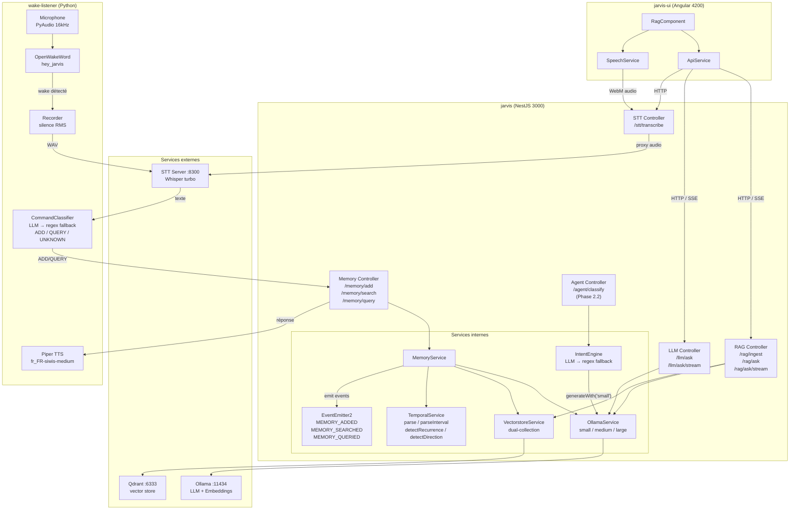
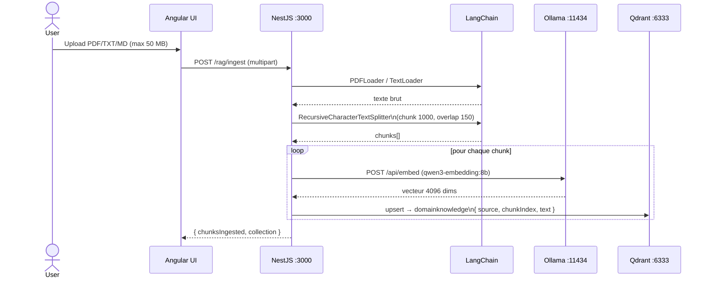
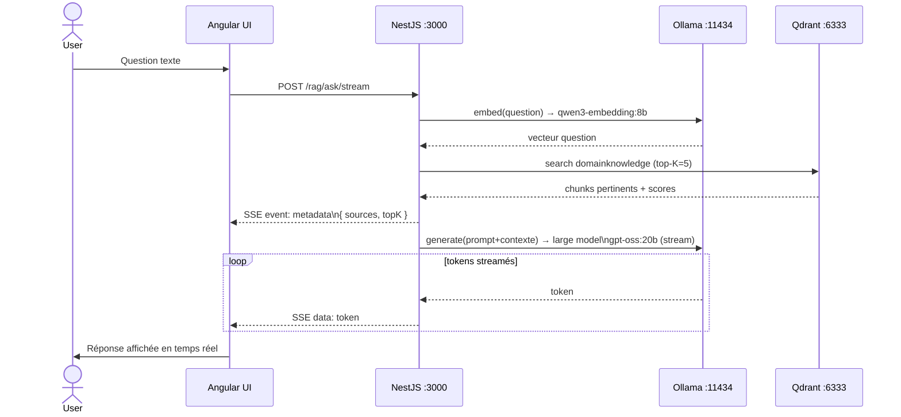
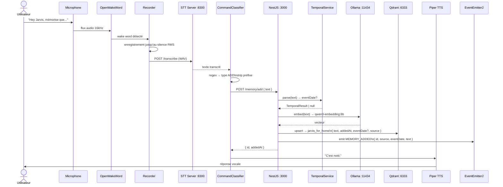
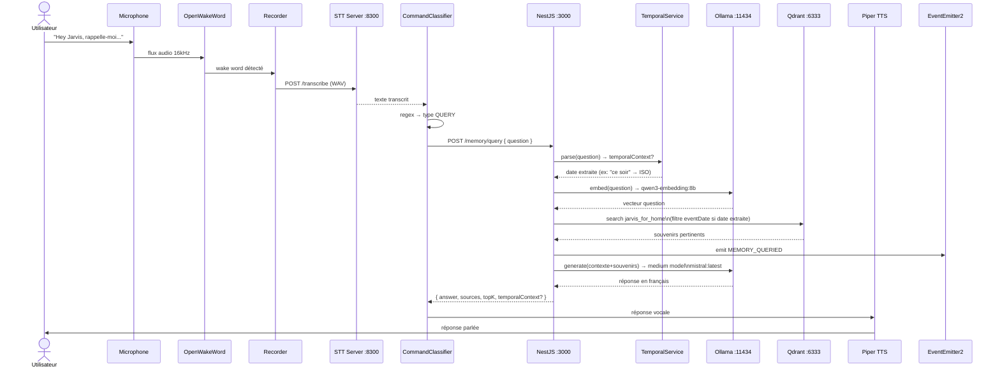
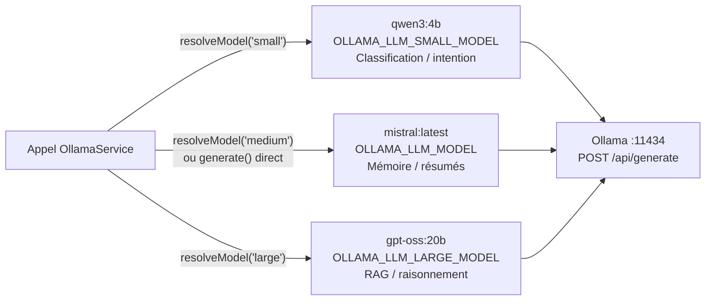
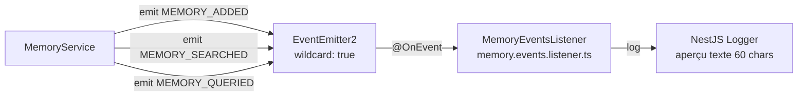
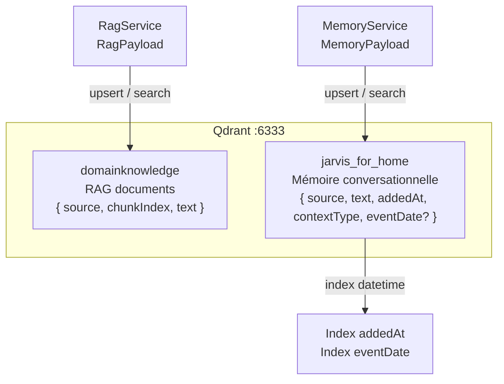

# Jarvis — Diagrammes d'architecture (Mermaid)

## 1. Vue d'ensemble des composants

---

## 2. Flux RAG — Ingestion de document

---

## 3. Flux RAG — Question / Réponse streamée

---

## 4. Flux Mémoire — Ajout via Wake Word

---

## 5. Flux Mémoire — Question / Réponse via Wake Word

---

## 6. Routage multi-modèle Ollama

---

## 7. Event Bus mémoire (EventEmitter2)

---

## 8. Dual-collection Qdrant

